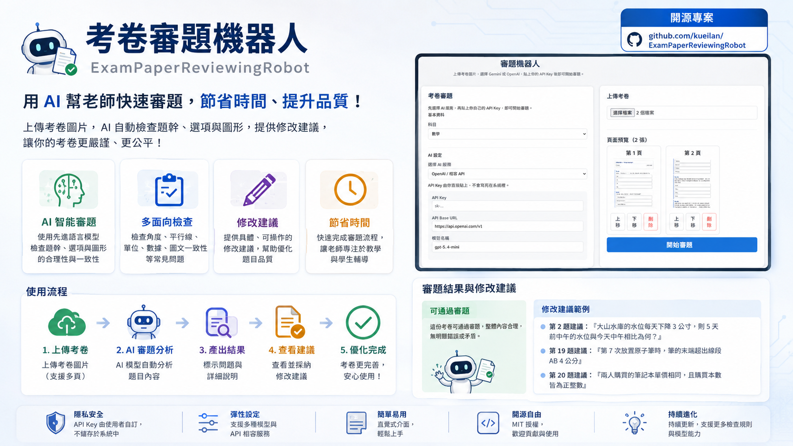

# 審題機器人

這是一個可以上傳考卷圖片、用 AI 協助審題的系統。

## 系統用途

審題機器人用來協助檢查考卷題目是否合理，並透過 AI 進行輔助分析。

系統支援：

- 上傳考卷圖片
- 選擇 AI 服務供應商
- 由使用者自行輸入 API Key
- 針對題目或整份考卷進行審題

## 使用前準備

你需要先準備以下環境：

- Python 3.13 以上
- Node.js 18 以上
- 一組可用的 AI API Key

目前支援的 AI 服務：

- Google Gemini
- OpenAI

## 啟動方式

### 1. 啟動後端

先進入後端資料夾並安裝依賴：

```bash
cd backend
pip install -r requirements.txt
```

再啟動後端服務：

```bash
python -m uvicorn main:app --host 0.0.0.0 --port 8000
```

啟動後可透過以下網址確認服務是否正常：

- `http://localhost:8000`
- `http://localhost:8000/docs`

如果你要讓同一個區網內的其他裝置連線，請使用這台主機的區網 IP 與 8000 埠。

### 2. 啟動前端

進入前端資料夾並安裝依賴：

```bash
cd frontend
npm install
```

啟動前端：

```bash
npm run dev
```

前端預設網址：

- `http://localhost:5173`

如果你要讓同一個區網內的其他裝置連線，前端也會綁定到 `0.0.0.0`，並可用這台主機的區網 IP 搭配 5173 埠開啟。

## 實際操作流程

### 考卷審題流程

1. 開啟前端頁面
2. 選擇 AI 服務供應商
3. 貼上對應的 API Key
4. 視需要調整 Base URL 或模型名稱
5. 上傳考卷圖片
6. 按下「開始審題」
7. 查看 AI 回傳的審題結果

### 題目檢查流程

1. 進入題目檢查頁面
2. 填入題目內容、答案、知識點等資料
3. 選擇題型、科目與難度
4. 如有題目圖片，也可以一併上傳
5. 送出後查看檢查結果

## AI 設定方式

### Google Gemini

1. 到 Google AI Studio 申請 API Key
2. 在前端選擇 `Google Gemini`
3. 貼上 API Key
4. 確認 Base URL 與模型名稱

常見預設值：

- Base URL：`https://generativelanguage.googleapis.com/v1beta`
- 模型：`gemini-1.5-flash`

### OpenAI

1. 到 OpenAI 平台申請 API Key
2. 在前端選擇 `OpenAI / 相容 API`
3. 貼上 API Key
4. 確認 Base URL 與模型名稱

常見預設值：

- Base URL：`https://api.openai.com/v1`
- 模型：`gpt-4o-mini`

如果你使用的模型不接受 `temperature=0.1`，系統會先自動改用預設值重試，並在結果中用白話方式說明原因。像 `gpt-5.5` 這類模型就可能出現這種情況。這通常不是 API Key 錯誤，而是模型本身的設定限制。

## 重要說明

- API Key 由使用者在前端自行輸入
- API Key 只會隨當次請求送出，不會寫入伺服器檔案
- 後端不再依賴任何舊版設定檔
- AI 的審題原則與判斷邏輯維持原本設計
- 如果你曾經用舊版方式放過真實金鑰，建議重新產生

## 常見問題

### Q1：API Key 需要寫到哪裡？

A：不需要寫到任何設定檔，直接在前端畫面輸入即可。

### Q2：後端還需要 `.env` 嗎？

A：不需要。這個版本已改成由前端直接輸入 API Key。

### Q3：如果審題失敗怎麼辦？

A：請先檢查以下幾點：

- 後端是否已啟動
- API Key 是否正確
- Base URL 是否符合所選服務
- 模型名稱是否正確
- 圖片是否成功上傳

如果你看到的是溫度設定不相容之類的提示，通常表示模型不接受目前的分析參數。系統會自動重試一次，若還是失敗，可以先換成較相容的模型，例如 `gpt-4o-mini`。

### Q4：結果看不懂怎麼辦？

A：可以先查看「錯誤」、「提醒」、「修改建議」三個區塊，再依照建議修正題目。

## 專案結構

```text
frontend/   React 前端
backend/    FastAPI 後端
README.md   專案說明
SETUP.md    安裝與使用說明
PROGRESS.md 開發狀態整理
```

## 技術棧

- 前端：React, Vite, Axios
- 後端：FastAPI, Python, httpx
- AI：Google Gemini API, OpenAI API

## 建議交付方式

如果你要把這個專案交給別人使用，建議直接告訴對方：

1. 先啟動後端
2. 再啟動前端
3. 在前端選擇 AI 服務
4. 貼上自己的 API Key
5. 上傳考卷後開始審題

這樣對方不需要碰任何伺服器設定檔，就能直接使用。
